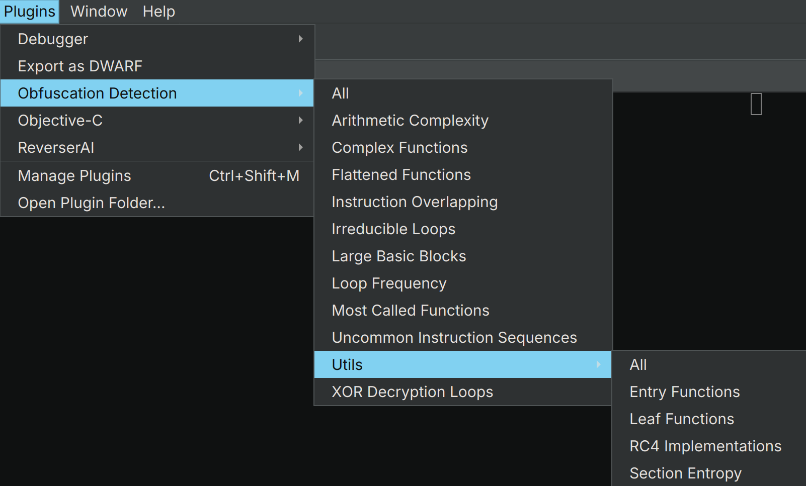
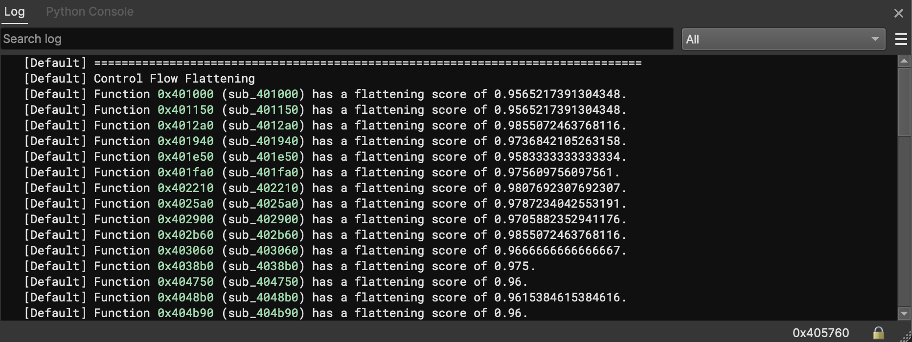

# Obfuscation Detection (v2.2)
Author: **Tim Blazytko**

_Automatically detect obfuscated code and other interesting code constructs_

## Description:

_Obfuscation Detection_ is a Binary Ninja plugin to detect obfuscated code and interesting code constructs (e.g., state machines) in binaries. Given a binary, the plugin eases analysis by identifying code locations which might be worth a closer look during reverse engineering.

Based on various heuristics, the plugin pinpoints functions that contain complex or uncommon code constructs. Such code constructs may implement

* obfuscated code
* state machines and protocols
* C&C server communication
* string decryption routines
* cryptographic algorithms

The following blog posts provide more information about the underlying heuristics and demonstrate their use cases:

* [Automated Detection of Control-flow Flattening](https://synthesis.to/2021/03/03/flattening_detection.html)
* [Automated Detection of Obfuscated Code](https://synthesis.to/2021/08/10/obfuscation_detection.html)
* [Statistical Analysis to Detect Uncommon Code](https://synthesis.to//2023/01/26/uncommon_instruction_sequences.html)
* [Identification of API Functions in Binaries](https://synthesis.to/2023/08/02/api_functions.html)

Some example use cases can be found in [examples](./examples). Furthermore, the REcon talk ["Unveiling Secrets in Binaries using Code Detection Strategies"](https://cfp.recon.cx/2023/talk/QD8UNJ/) demonstrates some use cases. The slides can be found [here](./presentation/recon23_code_detection.pdf); the recording can be found [here](https://www.youtube.com/watch?v=y95MNr2Xu-g).


## Core Features

* identifies interesting code constructs in large binaries
* highlights disaligned instructions in Binary Ninja's graph view
* efficient and architecture-agnostic implementation
* runs as a background task
* can be used in UI and headless mode


## Installation

The tool can be installed using Binary Ninja's plugin manager.

For the headless version, follow these steps:

```
git clone https://github.com/mrphrazer/obfuscation_detection.git
cd obfuscation_detection

# install obfuscation_detection
pip install .
```


## Usage

The plugin can be used in the user interface and in headless mode.


### User Interface

Choose the index tab `Plugins -> Obfuscation Detection` to run one or more detection heuristics in Binary Ninja's user interface:

<p align="left">

</p>

The results are displayed in the Log window:

<p align="center">

</p>

By clicking on the identified function addresses, Binary Ninja navigates to the selected function.


### Headless

To use the plugin in headless mode, run [`scripts/detect_obfuscation.py`](scripts/detect_obfuscation.py):

```
$ python3 scripts/detect_obfuscation.py <binary>
```


## Detection Heuristics

The plugin implements various detection heuristics to detect different code constructs. In the following, we briefly describe the individual heuristics and explain their usage. 

### Large Basic Blocks

The large basic block heuristic identifies the top 10% of functions with the largest average number of instructions per basic block. It allows to detect

* unrolled code
* cryptographic implementations
* initialization routines
* arithmetic obfuscation / Mixed Boolean-Arithmetic

### Complex Functions

To complex functions heuristic identifies the top 10% of functions with the most complex control-flow graphs (based on cyclomatic complexity). It allows to identify

* complex dispatching routines and protocols
* state machines
* functions obfuscated with opaque predicates


### Flattened Functions

The flattened function heuristic uses some graph-theoretic properties to identify functions implementing state machines. Usually, such state machines can be represented as switch statements that are dispatched in a loop. The heuristic allows to identify

* network protocol dispatching
* file parsing logic
* C&C server communication / command dispatching
* control-flow flattening


### Uncommon Instruction Sequences

The uncommon instruction sequences heuristic performs a statistical analysis to identify the top 10% of functions whose code patterns deviate from a pre-computed ground truth. This way, the heuristic allows to identify

* cryptographic implementations
* intense usage of floating point arithmetic
* arithmetic obfuscation / Mixed Boolean-Arithmetic
* generic obfuscation patterns


### Instruction Overlapping

The instruction overlapping heuristic identifies functions with disaligned instructions (instruction bytes are shared by two different instructions). The heuristic identifies

* broken disassembly (e.g., data which is marked as code)
* opaque predicates which jump into other instructions 

If the heuristic is used in Binary Ninja's user interface, overlapping instructions are also highlighted in the graph view.


### Most Called Functions

The heuristic for most called functions identifies the top 10% of functions with the largest number of calls from different functions. This way, the heuristic can identify

* string decryption routines
* library functions in statically linked binaries


### High Loop Frequency

The heuristic identifies functions with a high number of loops. These kind of functions might implement

* a complex parsing logic for structured data formats
* intensive algorithmic computations

The heuristic also helps pinpointing potential performance bottlenecks.


### Irreducible Loops

The heuristic identifies functions with rare and complex loop structures that typically suggest

* aggressive compiler optimizations
* hand-written assembly
* usage of goto statements
* obfuscated code


### XOR Decryption Loops

The heuristic identifies functions which perform an XOR operation with a constant inside of a loop. This way, the heuristic can identify

* string decryption routines
* code decryption stubs
* cryptographic implementations


### Complex Arithmetic Expressions 

The heuristic identifies functions in which the expressions have more than one arithmetic operation and one boolean operation simultaneously. This way, the heuristic can identify

* mixed-boolean arithmetic obfuscation
* initialization routine
* cryptographic implementations


### Duplicated Basic Blocks

This feature scans the basic blocks of each function and generates a fuzzy hash from their instruction sequences. By comparing these hashes, it identifies functions that contain duplicate or near-duplicate blocks. This helps pinpoint:

* repeated code snippets within or across functions
* compiler-generated duplicates (e.g., inlined code, loop unrolling)
* potential obfuscation patterns involving replicated blocks


## Utils

Contrary to the detection heuristics which target a wider scope of code, the plugin also implements various helpers which aim to identify functions with a narrower scope. In the following, we describe these helpers and explain their characteristics.


### Entry Functions

This helper identifies functions without known callers. These functions might be 

* entry points in the binary
* indirect jumps targets where the call hierarchy could not be recovered by the disassembler


### Leaf Functions

This helper identifies functions that do not call other functions. These kinds of functions may, for example, be functions that

* are outlined by the compiler to implement functionalities utilized across various code locations
* are trampolines to other functions
* are part of code obfuscation schemes (e.g., outlined computations for control-flow obfuscation)


### Recursive Functions

This helper identifies recursive functions---functions that directly or indirectly call themselves. Recursive functions may indicate:

* algorithmic implementations such as tree or graph traversal
* obfuscated code designed to complicate static analysis
* implementations of mathematical algorithms or complex parsing routines
* potential stack overflow vulnerabilities due to deep recursion


### Section Entropy

This helper evaluates the entropy of each section. Entropy is a statistical measure of randomness with values ranging between 0 and 8. Sections with an entropy close to 8 indicate a high degree of randomness and can hint at:

* packed or compressed code
* encrypted data or code
* random data


### RC4

This helper detects potential RC4 algorithm implementations by employing heuristic markers typically associated with RC4's Key Scheduling Algorithm (KSA) and Pseudo-Random Generation Algorithm (PRGA). RC4 is widely used in malware for purposes such as:

* decrypting strings and other data payloads
* obfuscating command and control (C&C) communications


## Contact

For more information, contact [@mr_phrazer](https://twitter.com/mr_phrazer).

