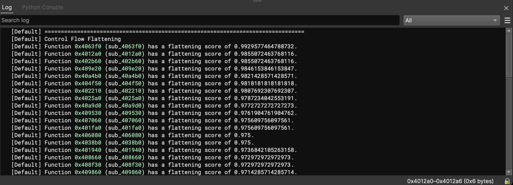

# Obfuscation Detection (v1.6)
Author: **Tim Blazytko**

_Automatically detect obfuscated code and other interesting code constructs_

## Description:

_Obfuscation Detection_ is a Binary Ninja plugin to detect obfuscated code and interesting code constructs (e.g, state machines) in binaries. Given a binary, the plugin eases analysis by identifying code locations which might be worth a closer look during reverse engineering.

Based on various heuristics, the plugin pinpoints functions that contain complex or uncommon code constructs. Such code constructs may implement

* obfuscated code
* state machines and protocols
* C&C server communication
* string decryption routines
* cryptographic algorithms

The following blog posts provide more information about the underlying heuristics and demonstrate their use cases:

* [Automated Detection of Control-flow Flattening](https://synthesis.to/2021/03/03/flattening_detection.html)
* [Automated Detection of Obfuscated Code](https://synthesis.to/2021/08/10/obfuscation_detection.html)
* [Statistical Analysis to Detect Uncommon Code](https://synthesis.to//2023/01/26/uncommon_instruction_sequences.html)


## Core Features

* identifies interesting code constructs in large binaries
* efficient and architecture-agnostic implementation
* runs as background task
* can be used in UI and headless mode


## Installation

The tool can be installed using Binary Ninja's plugin manager.

For the headless version, follow these steps:

```
git clone https://github.com/mrphrazer/obfuscation_detection.git
cd obfuscation_detection

# install obfuscation_detection
pip install .
```


## Usage

The plugin can be used in the user interface and in headless mode.

### User Interface

Choose the index tab `Plugins -> Obfuscation Detection` to run one or more detection heuristics in Binary Ninja's user interface:

<p align="left">

</p>

The results are displayed in the Log window:

<p align="center">

</p>

By clicking on the identified function addresses, Binary Ninja navigates to the selected function.


### Headless

To use the plugin in headless mode, run `scripts/detect_obfuscation.py`:

```
$ scripts/detect_obfuscation.py   samples/finspy 
================================================================================
Control Flow Flattening
Function 0x401602 (sub_401602) has a flattening score of 0.9473684210526315.
Function 0x4017c0 (sub_4017c0) has a flattening score of 0.9981378026070763.
Function 0x405150 (sub_405150) has a flattening score of 0.9166666666666666.
Function 0x405270 (sub_405270) has a flattening score of 0.9166666666666666.
Function 0x405370 (sub_405370) has a flattening score of 0.9984544049459042.
Function 0x4097a0 (sub_4097a0) has a flattening score of 0.9992378048780488.
Function 0x412c70 (sub_412c70) has a flattening score of 0.9629629629629629.
Function 0x412df0 (sub_412df0) has a flattening score of 0.9629629629629629.
Function 0x412f70 (sub_412f70) has a flattening score of 0.9927007299270073.
Function 0x4138e0 (sub_4138e0) has a flattening score of 0.9629629629629629.
================================================================================
Cyclomatic Complexity
Function 0x4097a0 (sub_4097a0) has a cyclomatic complexity of 524.
Function 0x405370 (sub_405370) has a cyclomatic complexity of 258.
Function 0x4017c0 (sub_4017c0) has a cyclomatic complexity of 214.
Function 0x412f70 (sub_412f70) has a cyclomatic complexity of 54.
Function 0x4138e0 (sub_4138e0) has a cyclomatic complexity of 10.
Function 0x412df0 (sub_412df0) has a cyclomatic complexity of 10.
Function 0x412c70 (sub_412c70) has a cyclomatic complexity of 10.
Function 0x401602 (sub_401602) has a cyclomatic complexity of 7.
Function 0x4013e3 (sub_4013e3) has a cyclomatic complexity of 5.
================================================================================
Large Basic Blocks
Basic blocks in function 0x405340 (sub_405340) contain on average 11 instructions.
Basic blocks in function 0x401240 (_start) contain on average 11 instructions.
Basic blocks in function 0x4013e3 (sub_4013e3) contain on average 10 instructions.
Basic blocks in function 0x413a80 (init) contain on average 9 instructions.
Basic blocks in function 0x401349 (sub_401349) contain on average 7 instructions.
Basic blocks in function 0x401030 (_init) contain on average 6 instructions.
Basic blocks in function 0x4097a0 (sub_4097a0) contain on average 6 instructions.
Basic blocks in function 0x405150 (sub_405150) contain on average 6 instructions.
Basic blocks in function 0x4017c0 (sub_4017c0) contain on average 6 instructions.
================================================================================
Uncommon Instruction Sequences
Function 0x401300 (sub_401300) has an uncommon instruction sequences score of 0.5.
Function 0x405370 (sub_405370) has an uncommon instruction sequences score of 0.4697142857142857.
Function 0x4016fa (sub_4016fa) has an uncommon instruction sequences score of 0.4444444444444444.
Function 0x4097a0 (sub_4097a0) has an uncommon instruction sequences score of 0.42799688635184224.
Function 0x4017c0 (sub_4017c0) has an uncommon instruction sequences score of 0.42788461538461536.
Function 0x412df0 (sub_412df0) has an uncommon instruction sequences score of 0.35294117647058826.
Function 0x412c70 (sub_412c70) has an uncommon instruction sequences score of 0.35294117647058826.
Function 0x412f70 (sub_412f70) has an uncommon instruction sequences score of 0.352.
Function 0x401290 (__ns_get32) has an uncommon instruction sequences score of 0.34782608695652173.
================================================================================
Instruction Overlapping
```

## Detection Heuristics

The plugin implements various detection heuristics to detect different code constructs. In the following, we briefly describe the individual heuristics and explain their usage. 

### Large Basic Blocks

The large basic block heuristic identifies the top 10% of functions with the largest avergage number of instructions per basic block. It allows to detect

* unrolled code
* cryptographic implementations
* initalization routines
* arithmetic obfuscation / Mixed Boolean-Arithmetic

### Complex Functions

To complex functions heuristic identifies the top 10% of functions with the most complex control-flow graphs (based on cyclomatic complexity). It allows to identify

* complex dispatching routines and protocols
* state machines
* functions obfuscated with opaque predicates


### Flattened Functions

The flattened function heuristic uses some graph-theoretic properties to identify functions implementing state machines. Usually, such state machines can be represented as switch statements that are dispatched in a loop. The heuristic allows to identify

* network protocol dispatching
* file parsing logic
* C&C server communication / command dispatching
* control-flow flattening


### Uncommon Instruction Sequences

The uncommon instruction sequences heuristic performs a statistical analysis to identify the top 10% of functions whose code patterns deviate from a pre-computed ground truth. This way, the heuristic allows to identify

* cryptographic implementations
* intense usage of floating point arithmetic
* arithmetic obfuscation / Mixed Boolean-Arithmetic
* generic obfuscation patterns


### Instruction Overlapping

The instruction overlapping heuristic identifies functions with disaligned instructions (instruction bytes are shared by two different instructions). The heuristic identifies

* broken disassembly (e.g., data which is marked as code)
* opaque predicates which jump into other instructions 

If the heuristic is used in Binary Ninja's user interface, overlapping instructions are also highlighted in the graph view.


### Most Called Functions

The heuristic for most called functions identifies the top 10% of functions with the largest number of calls from different functions. This way, the heuristic can identify

* string decryption routines
* library functions in statically linked binaries


## Test Samples

The malware samples in `samples.zip` can be used to test the plugin and reproduce the results from the blog posts. To unpack, use the passwort "infected" or the following command:

```
$ unzip -P infected samples.zip
```

In particular, the following samples `emotet`, `adylkuzz` and `plugx` are worth a closer look.


### Emotet

`emotet` obfuscates its control-flow via control-flow flattening, which can be identified by the flattening heuristic. Furthermore, the heuristic for uncommon instruction sequences pinpoints functions which apply arithmetic encodings to the control-flow flattening states.


### Adylkuzz

`adylkuzz` is protected by VMProtect. It uses various anti-disassembly tricks like opaque predicates which jump into disaligned code, causing the disassembler to produce invalid disassembly and garbage code. Using the instruction overlapping heuristic, a majority of these functions with garbage code can be identified.


### PlugX

`plugx` is not obfuscated. However, the flattening heuristic can be used to identify the communication with the command and control server as well as command dispatching routines.


## Contact

For more information, contact [@mr_phrazer](https://twitter.com/mr_phrazer).

